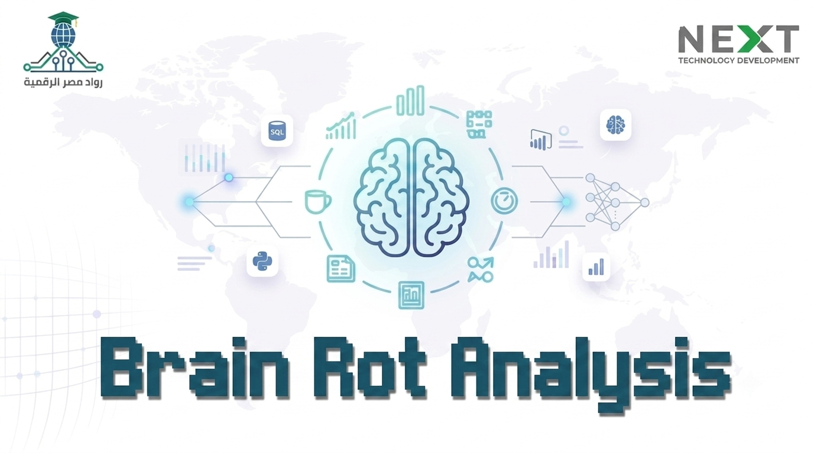

<div align="center">



---

**Studying the relationship between short-form content consumption and student attention, productivity, and wellbeing through data.**

An end-to-end analytics project that takes a dataset from raw CSV through a modeled star schema, Jupyter-based EDA, a production-grade multi-page Plotly Dash dashboard, and a trained Random Forest classifier — all inside one cohesive repository.

[Overview](#overview) • [Features](#key-features) • [Dashboard Pages](#dashboard-pages) • [Architecture](#dashboard-architecture) • [Structure](#repository-structure) • [Tech Stack](#tech-stack) • [Machine Learning](#machine-learning) • [Installation](#installation) • [Contributors](#contributors) • [License](#license)

<br>


</div>

<br>

## Overview

Brain Rot Analytics investigates how short-form social media consumption — reels, clips, and short videos — affects student cognitive performance, study productivity, and self-reported wellbeing. The project covers the complete analytics lifecycle: raw data is cleaned and structured into a relational star schema, explored through Jupyter notebooks, and surfaced through an interactive multi-page dashboard. A trained machine learning model completes the pipeline by classifying students into four digital distraction stages based purely on their daily behavioral habits.

The motivating question is straightforward: does heavy short-form content consumption measurably reduce a student's ability to focus and study? The data says yes — and this project quantifies how and where that relationship is strongest.

The dataset covers 5,000 daily activity records from 99 Egyptian students, tracked across a full calendar year with demographic, device, date, and behavioral attributes organized into a fact-and-dimension schema.

<br>

## Key Features

| Feature | Description |
|---|---|
| **Multi-page Plotly Dash application** | 10 navigable pages, each with a distinct analytical purpose, linked by a persistent collapsible sidebar. |
| **Global cross-page filtering** | A single filter bar (age group, region, device, brain rot stage, wellbeing band, coffee level, smoking status, study hours range, date range) broadcasts filtered data to every chart on every page via a shared `dcc.Store`. |
| **12 dynamic KPI cards** | The Home page displays live summary metrics — records, unique users, wellbeing score, brain rot exposure, healthy/critical user rates, study hours, reels/day, focus sessions, short-content percentage, top region, and coffee consumption — all recalculated on filter change. |
| **Dark / Light mode with persistent state** | Theme preference is stored in `localStorage` via `dcc.Store` and applied both to Dash component classes and directly to all Plotly figures through a MutationObserver-driven JavaScript engine in `theme.js`. |
| **Automated Insights engine** | The Insights page computes up to 8 statistically-grounded findings directly from the live filtered sample — no hardcoded numbers. Each insight only fires if the underlying data shows a meaningful gap. |
| **Glassmorphism UI** | The entire application uses a custom dark design system built in CSS with semi-transparent surfaces, soft glows, and consistent Inter typography, applied across cards, filters, sidebar, and charts. |
| **Interactive scatter explorer** | The Correlation page provides a user-controllable scatter plot: any two numeric columns on X/Y, colored by any categorical column, with an OLS trendline and live Pearson r in the chart title. |
| **Star schema data model with ETL layer** | `data/loader.py` loads five raw CSVs, resolves known data quality issues explicitly, merges them into a single denormalized analytical dataframe, and adds derived columns — all cached in-process for zero repeated I/O. |
| **Random Forest classifier with Streamlit app** | A trained Random Forest model (macro F1 = 0.892, accuracy = 93.8%) classifies a student's brain rot stage from 7 behavioral inputs, served through an interactive Streamlit prediction app. |
| **Power BI dashboard** | A supplementary `.pbix` file with its own set of BI-oriented views is included in `dashboards_BI/`. |
| **CSV export from user table** | The Users page data table supports native CSV export directly from the dashboard. |
| **Back-to-top button** | A floating back-to-top control appears after scrolling 240px, driven by the same JavaScript module that handles theme synchronization. |

<br>

## Dashboard Pages

### Home — Executive Summary

The landing page gives an immediate pulse on the entire dataset. Twelve KPI cards surface the most important headline numbers. Below those, four charts tell the top-level story: a dual-axis time-series tracking Wellbeing Score against Brain Rot Exposure over the year, a donut showing the distribution across the four brain rot stages, a horizontal bar ranking regions by average wellbeing, and a treemap breaking down device usage by brain rot stage.

**Charts:** Time series (Wellbeing vs Brain Rot Exposure), Stage distribution donut, Region × Wellbeing bar, Device × Stage treemap.

---

### Overview — Dataset Profile

A demographic and distributional view of the filtered sample. Useful for understanding who is in scope before drilling into behavioral pages.

**Charts:** Age distribution histogram, Records by age group bar chart, Region → Device sunburst, Device type donut, Multi-panel box plots across six key numeric metrics, Summary statistics table (mean, std, min, quartiles, max).

---

### Users — Demographic Segments

Focuses on the student population itself: how different age groups use different devices, how behaviors cluster by device type, and who the top-performing students are by wellbeing score.

**Charts:** Age group × Device type grouped bar, Device behavior radar chart (normalized across Study Hours, Reels Watched, Focus Sessions, Wellbeing, Brain Rot Exposure), Smoking status donut, User segmentation bubble scatter (Study Hours vs Wellbeing, bubble size = reels watched), Top 10 users by average wellbeing horizontal bar, Paginated and filterable user directory table with CSV export.

---

### Mental Health & Wellbeing

Maps wellbeing, attention span, and focus patterns. Explicitly notes that clinical scales (anxiety, depression, stress) are not present in this dataset — Wellbeing Score, Attention Span Level, and Focus Sessions are used as the real proxies.

**Charts:** Wellbeing Score distribution histogram (colored by wellbeing band), Wellbeing Band funnel chart, Avg Focus Sessions by Attention Span Level bar, Reels Watched vs Wellbeing scatter with continuous Brain Rot Exposure color scale and optional OLS trendline, Parallel categories chart tracing Attention Span → Brain Rot Stage → Wellbeing Band → Exam Season flow.

---

### Social Media Usage

Examines reel consumption patterns: how they trend over time, when during the day they peak, how they vary across the week, and how short-content share compares across brain rot stages.

**Charts:** Average Reels Watched time series (area fill), Peak usage hour bucket donut, Reel consumption heatmap (Day of Week × Peak Hour), Short-Form Content % by Brain Rot Stage violin plot with embedded box, Weekday vs Weekend reel consumption grouped bar.

---

### Study & Productivity

Focuses on the study side of the equation — how daily habits interact with study hours and focus sessions. Notes that GPA is absent from the dataset; Study Hours and Focus Sessions Count are used as the productivity proxies.

**Charts:** Study Hours density histogram by Brain Rot Stage with rug plot, Coffee Level vs Study Hours & Focus Sessions grouped bar, Study Hours vs Brain Rot Exposure scatter (colored by Focus Sessions), Study Hours distribution by Exam Season vs Regular box plot, Avg Focus Sessions progression across Brain Rot Stages waterfall chart.

---

### Brain Rot Score — Deep-Dive

A dedicated page for the Brain Rot Exposure Score metric and its four-stage classification. Shows how the score distributes, which behaviors drive it, how it maps geographically, and a 3D view of its relationship to study time and wellbeing.

**Charts:** Brain Rot Exposure Score distribution histogram by stage, Users per Brain Rot Stage bar, Top behavioral drivers (correlation with Brain Rot Exposure) horizontal bar, 3D scatter (Reels Watched × Study Hours × Wellbeing, colored by stage), Brain Rot Stage composition heatmap by region (percentage within each region).

---

### Correlation Analysis

A full correlation workspace. Displays the full numeric correlation matrix, a configurable scatter explorer where the user selects X axis, Y axis, and color dimension from dropdowns, a scatter matrix across four core metrics, and a ranked bar of the five strongest positive and five strongest negative pairwise correlations.

**Charts:** Full correlation heatmap (annotated with values), Interactive scatter explorer with OLS trendline and live Pearson r, Scatter matrix (Study Hours, Reels Watched, Brain Rot Exposure, Wellbeing), Strongest positive & negative correlations bar.

---

### Automated Insights

Runs up to 8 automatically generated findings against the current filtered sample. Each insight compares two real slices of data and only renders if the gap is statistically meaningful (threshold varies by insight type). Topics covered include: reel consumption vs wellbeing gap, late-night activity vs wellbeing, exam season vs brain rot exposure, coffee level vs focus sessions, healthy vs critical stage study hours, short-content share vs attention span, weekend vs weekday reel consumption, and the highest-exposure region.

---

### About

Project documentation embedded inside the application. Includes a data model card (star schema description with all five tables), a data quality notes card (the two explicitly handled issues: orphan UserKey=100 and null Coffee_Level), a full interactive data dictionary table covering every column across all five tables, and a tech stack badge section.

<br>

## Dashboard Architecture

### Application Entry Point

`web_app/app.py` initializes the Dash application with `use_pages=True`, registers the Bootstrap DARKLY theme, loads Inter from Google Fonts, and lays out the application shell. The shell contains:

- `dcc.Location` for URL routing
- `dcc.Store(id="global-filtered-data")` — the single shared data bus that all page charts consume
- `dcc.Store(id="theme-store", storage_type="local")` — persists dark/light preference across browser sessions
- The collapsible sidebar (`components/sidebar.py`)
- The persistent top bar with the title and theme toggle button
- The global filter bar (`components/filters.py`)
- `dash.page_container` for the active page

Callback modules are imported at the bottom of `app.py`, which registers them against the shared `app` instance.

### Routing

Dash Pages (`use_pages=True`) handles all routing. Each page file calls `dash.register_page(__name__, path="...", name="...", title="...")`. The sidebar links are a static list of `dcc.Link` elements; the active link class is synchronized by a URL-watching callback in `ui_callbacks.py`.

### Data Flow

```
web_app/data/raw/*.csv (5 files)
        │
        ▼
web_app/data/loader.py
  build_master_dataframe()          ← load, clean, merge, derive
  get_master_df()                   ← in-process cache (module singleton)
        │
        ▼
callbacks/filter_callbacks.py
  apply_global_filters()            ← reads filter widget states
        │  writes JSON
        ▼
dcc.Store("global-filtered-data")   ← shared data bus
        │  all pages subscribe
        ▼
Page callbacks (Input: global-filtered-data → Output: figure/children)
```

### Callbacks

| File | Responsibility |
|---|---|
| `callbacks/filter_callbacks.py` | Reads all 10 filter widget states, applies them to the master dataframe, serializes the result to the global store, and generates a human-readable filter summary badge. Also handles filter reset. |
| `callbacks/ui_callbacks.py` | Theme toggle (dark ↔ light), sidebar collapse/expand, active nav link highlighting, filter bar visibility (hidden on the About page). |

Each page registers its own chart callbacks locally using `@callback`, subscribing only to `global-filtered-data` as input.

### Components

| Component | Description |
|---|---|
| `components/sidebar.py` | Collapsible navigation sidebar. 10 nav items, each with a Bootstrap Icon and label. Includes a GitHub link in the footer. |
| `components/filters.py` | Global filter bar with multi-selects for 7 categorical dimensions, a range slider for Study Hours, a date range picker, and Apply/Reset buttons. |
| `components/kpi_card.py` | Reusable glassmorphism KPI tile with icon, value, label, optional suffix, and optional delta indicator. `kpi_row()` lays out a list of cards in a responsive grid. |

### Utilities

| File | Description |
|---|---|
| `utils/chart_helpers.py` | Registers a shared Plotly dark template (`brainrot_dark`) at import time. Provides `style_fig()` (applies consistent height, margins, template), `empty_state()` (friendly placeholder when a filtered slice is empty), and `guard()` (empty-dataframe check). |
| `utils/insights_engine.py` | `generate_insights(df)` computes up to 8 data-driven insight objects from the filtered dataframe. Each insight includes an icon, color, title, and dynamically formatted text. Fires only when the underlying gap crosses a minimum threshold. |

### Configuration

`config/settings.py` centralizes all shared constants: app title, subtitle, GitHub URL, the full color palette (dark glassmorphism tokens), stage ordering and stage-to-color maps, wellbeing band ordering and colors, the categorical color sequence used by every chart, and the Plotly template name.

### Assets

| File | Description |
|---|---|
| `assets/style.css` | ~29 KB custom stylesheet. Defines the complete dark design system (CSS variables), sidebar layout, topbar, filter bar, KPI cards, page containers, glassmorphism surfaces, light/dark theme overrides, and scroll utilities. |
| `assets/theme.js` | Vanilla JavaScript IIFE. Uses a MutationObserver on `#app-shell` to detect theme class changes and re-applies layout properties to every Plotly figure via `Plotly.relayout`. Also manages filter bar scroll-stuck state and the back-to-top button. |

<br>

## Repository Structure

```
Neuro-Digital-Analytics/
│
├── README.md
├── README_Banner.png
├── LICENSE
│
├── web_app/                          # Plotly Dash application
│   ├── app.py                        # Entry point — initialize Dash, layout, import callbacks
│   ├── .hintrc                       # Browser compatibility config
│   │
│   ├── assets/
│   │   ├── style.css                 # Full custom CSS design system (~29 KB)
│   │   └── theme.js                  # Dark/light theme sync engine for Plotly figures
│   │
│   ├── callbacks/
│   │   ├── filter_callbacks.py       # Global filter logic → dcc.Store
│   │   └── ui_callbacks.py           # Sidebar, theme, active nav, filter visibility
│   │
│   ├── components/
│   │   ├── filters.py                # Global filter bar component
│   │   ├── kpi_card.py               # Reusable KPI card and grid layout
│   │   └── sidebar.py                # Collapsible navigation sidebar
│   │
│   ├── config/
│   │   └── settings.py               # All shared constants: colors, stage maps, paths
│   │
│   ├── data/
│   │   ├── loader.py                 # ETL: load CSVs, clean, merge, derive columns
│   │   └── raw/                      # Star schema CSVs (Fact + 4 Dims)
│   │       ├── Fact_User_Activity.csv
│   │       ├── Dim_Users.csv
│   │       ├── Dim_Date.csv
│   │       ├── Dim_MentalState.csv
│   │       └── Dim_Habits.csv
│   │
│   ├── pages/
│   │   ├── home.py                   # Executive summary + 12 KPIs
│   │   ├── overview.py               # Demographics, distributions, summary stats
│   │   ├── users.py                  # User segments, device profiles, directory
│   │   ├── mental_health.py          # Wellbeing, attention span, focus analysis
│   │   ├── social_media.py           # Reel consumption patterns and heatmaps
│   │   ├── study.py                  # Study hours, focus sessions, productivity
│   │   ├── brain_rot.py              # Brain Rot Score deep-dive + 3D scatter
│   │   ├── correlation.py            # Correlation matrix + interactive explorer
│   │   ├── insights.py               # Automated insight cards (live computation)
│   │   └── about.py                  # Data model, quality notes, data dictionary
│   │
│   └── utils/
│       ├── chart_helpers.py          # Shared Plotly template, style_fig, guard
│       └── insights_engine.py        # Automated insight generation engine
│
├── machine_learning/                 # ML pipeline
│   ├── train_model.ipynb             # Training notebook: EDA → preprocessing → model selection → evaluation
│   ├── streamlit_app.py              # Interactive prediction app (7 inputs → stage prediction)
│   ├── utils.py                      # Feature list, preprocessing, column alignment helpers
│   ├── requirements.txt              # ML-specific dependencies
│   └── model/                        # Persisted model artifacts
│       ├── brainrot_model.pkl        # Trained Random Forest (~14 MB)
│       ├── encoder.pkl               # Fitted label encoder
│       ├── scaler.pkl                # Fitted StandardScaler
│       ├── metadata.pkl              # Training column list for inference alignment
│       ├── feature_importance.csv    # Feature importance scores
│       ├── feature_importance.png    # Feature importance bar chart
│       ├── confusion_matrix.png      # Confusion matrix heatmap
│       └── classification_report.txt # Per-class precision/recall/F1 + overall metrics
│
├── data/                             # Source data
│   ├── BrainRot_Final_Dataset.csv    # Raw merged dataset (5,000 rows, 30 columns)
│   ├── raw/                          # Original star schema CSV files (same as web_app/data/raw)
│   └── processed/                    # Cleaned/transformed outputs
│
├── notebooks/                        # Jupyter EDA and analysis
│   ├── 01_exploration.ipynb          # Initial data profiling and overview
│   ├── 02_cleaning.ipynb             # Data cleaning and quality handling
│   ├── 03_analysis.ipynb             # Statistical analysis and visualizations
│   └── Brain_Rot_Data_Generator.ipynb # Synthetic data generation notebook
│
├── sql/                              # SQL Server schema and load scripts
│   ├── Setup_BrainRotAnalysis.sql    # CREATE TABLE statements (star schema DDL)
│   ├── Insert_BrainRotAnalysis_Data.sql # Full INSERT statements for all tables
│   └── database_erd.png              # Entity-relationship diagram
│
├── dashboards_BI/
│   └── Brain-rot_final_Dashboard.pbix # Power BI dashboard file
│
├── visuals/                          # Chart exports and dashboard screenshots
│   ├── charts_gallery/               # Individual chart export assets
│   └── dashboards_screenshots/       # Screenshots of the dashboard and Power BI
│       ├── plotly_dash/
│       └── power_bi/
│
├── docs/
│   ├── Data_Dictionry.csv            # Column-level data dictionary
│   └── Final Project Proposal Form.docx
│
└── chatbot/                          # Placeholder (see AI Chatbot section)
```

<br>

## Tech Stack

| Technology | Role |
|---|---|
| **Python 3** | Core language across the entire project |
| **Plotly Dash** | Web application framework; `use_pages=True` multi-page routing |
| **Plotly (Express + Graph Objects)** | All interactive chart types: scatter, bar, histogram, box, violin, heatmap, treemap, sunburst, parallel categories, waterfall, scatter 3D, scatter matrix |
| **Dash Bootstrap Components** | Responsive grid layout, modals, alerts, collapse, badges |
| **Pandas** | Data loading, merging, cleaning, groupby aggregations, derived columns |
| **NumPy** | Numerical operations in the ETL layer and insights engine |
| **Scikit-learn** | Random Forest, Logistic Regression, StandardScaler, LabelEncoder, RandomizedSearchCV, train/test split, classification report |
| **XGBoost** | Candidate model evaluated during model selection in the training notebook |
| **imbalanced-learn** | Imbalanced class handling during ML experimentation |
| **Joblib** | Model and artifact serialization (`.pkl` files) |
| **Streamlit** | Standalone prediction interface for the trained model |
| **Matplotlib / Seaborn** | Static chart generation in the training notebook |
| **SQL Server** | Relational schema design, DDL, and INSERT scripts |
| **Power BI** | Supplementary BI dashboard (`.pbix`) |
| **Jupyter Notebook** | EDA notebooks and ML training |
| **HTML5 / CSS3 / JavaScript** | Custom design system (`style.css`), theme engine (`theme.js`) |
| **Bootstrap Icons** | Icon set used across sidebar navigation and KPI cards |
| **Inter (Google Fonts)** | Primary typeface for the dashboard UI |

<br>

## Machine Learning

### Objective

Classify a student's `Brainrot_Stage` — one of four ordered categories (Healthy, Casual, Advanced, Critical) — from a set of 7 daily behavioral inputs. The goal is to identify digital distraction severity before it becomes critical, using only observable habits rather than derived composite scores.

### Data Considerations

The target variable is significantly imbalanced in the raw dataset: Healthy 61%, Critical 18%, Advanced 12.5%, Casual 8.5%. Target-derived columns (`Brainrot_Exposure_Score`, `Wellbeing_Score`, `Attention_Span_Level`, `Aura_Color_Code`, `Coffee_Level`, `Smoking_Status`) were deliberately excluded from training features to prevent data leakage — these are outputs of the same behavioral process the model is trying to predict.

### Pipeline

| Step | Details |
|---|---|
| **Data loading** | `BrainRot_Final_Dataset.csv` (5,000 rows, 30 columns) loaded via `machine_learning/utils.py` |
| **Missing value imputation** | 51 rows had missing values across `Age`, `Age_Group`, `Region`, `Device_Type`, `Is_Smoker`, `Base_Focus_Level` — imputed using median/mode, preserving the full sample |
| **Feature selection** | 7 features retained: `Age`, `Total_Reels_Watched`, `Coffee_Consumed_Per_Day`, `Focus_Sessions_Count`, `Study_Hours`, `Is_Late_Night`, `Device_Type` |
| **Encoding** | `Device_Type` one-hot encoded; `Is_Late_Night` is already binary |
| **Train/test split** | Stratified 80/20 split to preserve class proportions |
| **Class imbalance** | Addressed via `class_weight='balanced'` |
| **Model comparison** | Logistic Regression (baseline), Random Forest, XGBoost — each tuned via `RandomizedSearchCV` |
| **Selection criterion** | Macro F1-score (preferred over accuracy to give equal weight to minority classes) |
| **Persistence** | Model, encoder, scaler, and training column metadata serialized to `machine_learning/model/` via Joblib |

### Final Model Performance

| Metric | Value |
|---|---|
| **Best model** | Random Forest |
| **Accuracy** | 93.8% |
| **Macro F1-score** | 0.892 |
| **Weighted F1-score** | 0.939 |

**Per-class results:**

| Class | Precision | Recall | F1 | Support |
|---|---|---|---|---|
| Healthy | 0.987 | 0.982 | 0.984 | 609 |
| Casual | 0.830 | 0.869 | 0.849 | 84 |
| Advanced | 0.790 | 0.897 | 0.840 | 126 |
| Critical | 0.945 | 0.851 | 0.895 | 181 |

### Feature Importance

| Feature | Importance |
|---|---|
| Total Reels Watched | 55.8% |
| Focus Sessions Count | 19.3% |
| Study Hours | 8.0% |
| Is Late Night | 5.8% |
| Age | 4.1% |
| Coffee Consumed Per Day | 2.6% |
| Device Type (Smartphone) | 2.4% |
| Device Type (Tablet) | 1.4% |
| Device Type (PC) | 0.6% |

### Prediction App

The `machine_learning/streamlit_app.py` application allows anyone to enter 7 daily behavioral inputs and receive an instant brain rot stage prediction, along with personalized recommendations for each stage classification.

<br>

## Dashboard Preview

> Screenshots can be found in `visuals/dashboards_screenshots/plotly_dash/`.

| Page | Screenshot |
|---|---|
| Home — Executive Summary | `visuals/dashboards_screenshots/plotly_dash/` |
| Mental Health & Wellbeing | `visuals/dashboards_screenshots/plotly_dash/` |
| Brain Rot Score Deep-Dive | `visuals/dashboards_screenshots/plotly_dash/` |
| Correlation Analysis | `visuals/dashboards_screenshots/plotly_dash/` |
| Automated Insights | `visuals/dashboards_screenshots/plotly_dash/` |

<br>

## AI Chatbot

**Status:** Under Development

The `chatbot/` directory is a placeholder for a planned conversational interface. Documentation will be added when the module is implemented.

<br>

## Installation

### Prerequisites

- Python 3.9 or later
- pip

### Clone the repository

```bash
git clone https://github.com/Mahmoud-islamcs/Neuro-Digital-Analytics.git
cd Neuro-Digital-Analytics
```

### Run the Plotly Dash Dashboard

```bash
cd web_app
python -m venv venv

# Windows
venv\Scripts\activate
# macOS / Linux
source venv/bin/activate

pip install dash dash-bootstrap-components pandas numpy plotly
python app.py
```

Open the dashboard at:

```
http://127.0.0.1:8050
```

The app respects `DASH_DEBUG` and `DASH_PORT` environment variables if you need to override defaults.

### Run the ML Prediction App

```bash
cd machine_learning
pip install -r requirements.txt
streamlit run streamlit_app.py
```

The Streamlit app opens automatically at:

```
http://localhost:8501
```

<br>

## Project Highlights

- **Clean separation of concerns.** The data layer (`loader.py`) owns all ETL logic. The config layer (`settings.py`) owns all constants. Callbacks are split between filter logic and UI logic. Pages own only their own charts.

- **Filter architecture that scales.** The global filter bar writes a single JSON payload to `dcc.Store`. Every chart across every page subscribes to that store as its sole input — one filter change triggers all charts simultaneously with no duplicated filtering logic anywhere.

- **Theme engine that actually works.** Light/dark switching is non-trivial in Plotly Dash because Plotly figures are rendered in iframes. `theme.js` uses a MutationObserver to detect `app-shell` class changes and re-applies layout properties to all figures via `Plotly.relayout`, reading CSS custom property values so dark and light palettes stay in sync with the stylesheet.

- **Data quality documented, not hidden.** The two known issues in the dataset (orphan UserKey=100, null Coffee_Level on HabitKey=1) are handled explicitly in `loader.py` with comments explaining the decision, and surfaced to users on the About page — rather than silently dropped or patched.

- **Automated insights with thresholds.** The insights engine does not generate fixed text or hardcoded numbers. Every insight computes a real percentage gap between two data slices and only fires when the gap exceeds a minimum meaningful threshold, so it degrades gracefully on heavily filtered small samples.

- **Leakage-free ML pipeline.** Target-derived columns are explicitly excluded from training features. The feature list, preprocessing steps, and column alignment logic are centralized in `machine_learning/utils.py` so the same transformations apply identically at training time and inference time.

<br>


## Contributors

Developed as part of a Data Analytics graduation project (DEPI Program).

1.	Abdelrahman Ayman Abdullah Matouk 
2.	Mahmoud Islam Mahmoud Ahmed 
3.	Ahmed Rabea Mohammed Abdelhameed
4.	Habiba Ahmed Abdelrazik Mansour

<br>

## License

This project is licensed under the **MIT License**. See the [`LICENSE`](LICENSE) file for full terms.

Copyright (c) 2026 Mahmoud Islam